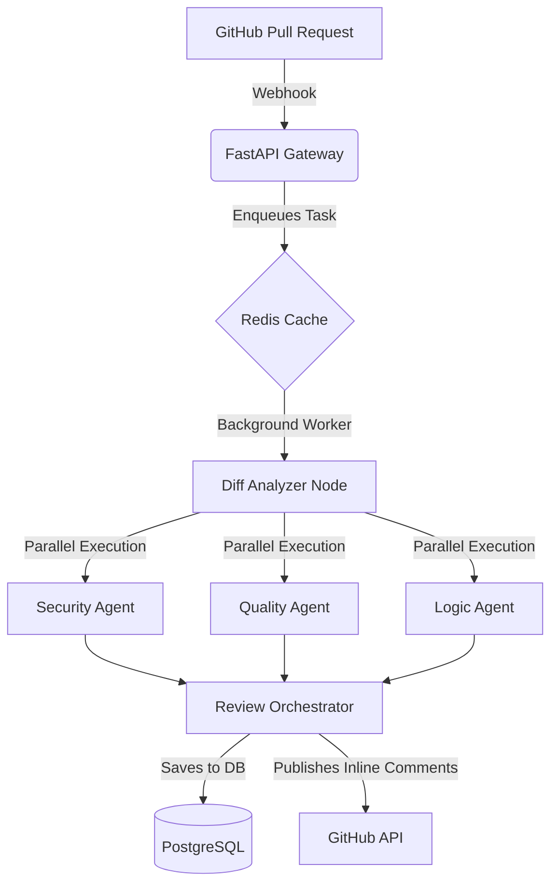
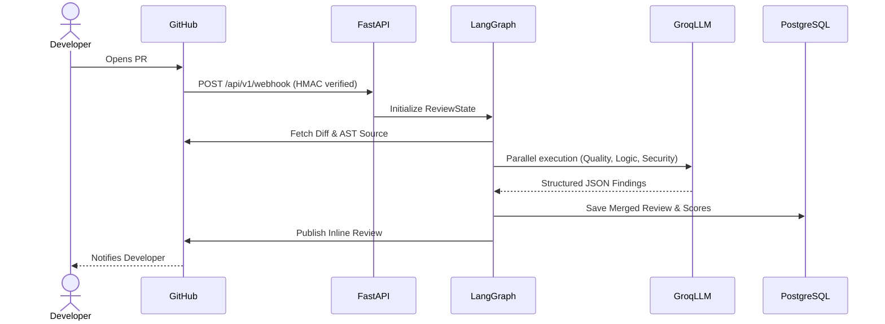
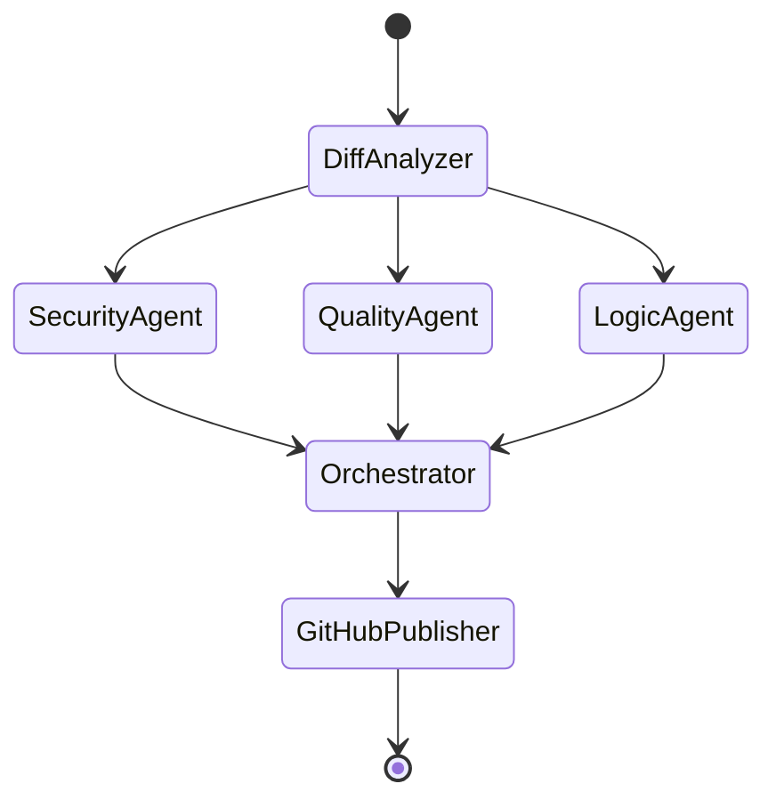
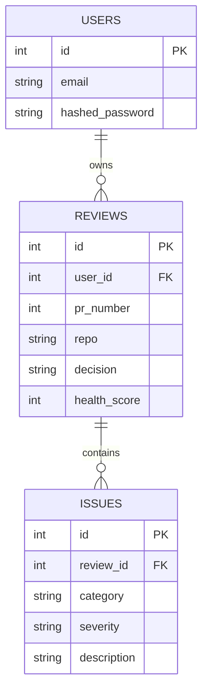

<div align="center">
  
  <h1>PRism — Intelligent Pull Request Review Agent</h1>
  <p><strong>Production-Grade AI Code Review System powered by LangGraph</strong></p>

  [](https://python.org)
  [](https://fastapi.tiangolo.com)
  [](https://langchain.com)
  [](LICENSE)
  [](RELEASE_NOTES.md)
</div>

<br />

PRism is a production-ready, asynchronous Backend AI system that automatically reviews GitHub Pull Requests. It orchestrates multiple specialized AI agents (Security, Quality, and Logic) in parallel to analyze your code, generate context-aware critiques, and natively publish actionable comments directly to your GitHub Pull Requests.

Built for scale, PRism leverages a highly optimized technology stack typically found at enterprise tech companies.

---

## 📸 Dashboard Showcase

> *Interactive Metrics, Agent Diagnostics, and Review Drill-downs.*


---

## ⚡ Core Features

- **Multi-Agent Orchestration**: LangGraph coordinates Security, Quality, and Logic agents.
- **AST Code Parsing**: Deep semantic understanding via `tree-sitter` (Python, TS, JS).
- **Enterprise Architecture**: FastAPI (async), PostgreSQL (asyncpg), Redis caching.
- **GitHub Native**: Secure Webhooks (`X-Hub-Signature-256`) and inline review publishing.
- **Demo Mode**: One-click local testing without requiring a live GitHub App setup.
- **Observability**: Prometheus metrics, JSON structured logging, and robust CI/CD.

---

## 🗺️ System Architecture

<details>
<summary><b>1. High-Level Architecture Diagram</b></summary>



</details>

<details>
<summary><b>2. Sequence Diagram (E2E Flow)</b></summary>



</details>

<details>
<summary><b>3. LangGraph Agent Flow</b></summary>



</details>

<details>
<summary><b>4. Database ER Diagram</b></summary>



</details>

<details>
<summary><b>5. Folder Structure</b></summary>

```mermaid
graph LR
    Root[PRism Repository] --> App[app/]
    App --> Agents[agents/ (LangGraph)]
    App --> API[api/ (FastAPI Routers)]
    App --> Core[core/ (GitHub & Parsers)]
    App --> DB[db/ (SQLAlchemy)]
    App --> Services[services/ (Review & AI)]
    
    Root --> Docs[docs/]
    Root --> Tests[tests/]
    Root --> Scripts[scripts/]
```

</details>

---

## 🚀 Quickstart (Recruiter Guide)

We value your time! PRism can be booted locally in **Demo Mode** under 2 minutes. No GitHub setup is required to see the AI in action.

### 1. Clone & Build
```bash
git clone https://github.com/prism-ai/prism.git
cd prism
cp .env.example .env
docker-compose up --build -d
```

### 2. View the Dashboard
Navigate to [http://localhost:8000/static/index.html](http://localhost:8000/static/index.html).

### 3. Trigger an AI Review (Demo Mode)
To simulate a Pull Request without connecting GitHub, simply hit the demo endpoint. The backend will parse mock Python files, spin up the AI agents in parallel, and store the results.

```bash
curl -X POST http://localhost:8000/api/v1/demo/trigger
```

Refresh your dashboard to see the real-time AI critique!


---

## 📖 Deep-Dive Documentation

For engineers looking to contribute or understand the internals:

- [Architecture Overview](docs/architecture.md)
- [Database & Migrations](docs/database.md)
- [LangGraph Orchestration](docs/langgraph.md)
- [Security Guidelines](docs/security.md)
- [GitHub Webhooks Setup](docs/github-webhook.md)
- [Production Deployment](docs/deployment.md)

---

## ⚖️ License

Distributed under the MIT License. See `LICENSE` for more information.
