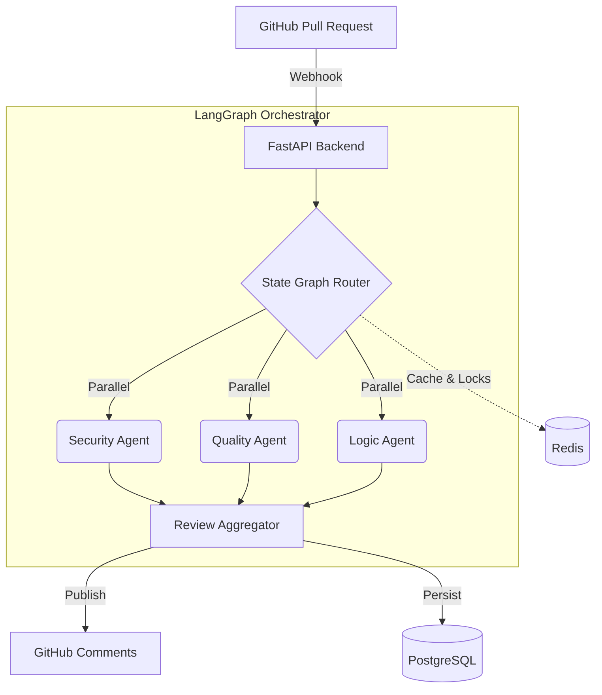

<div align="center">
  
# PRism
**AI-Powered Pull Request Review Agent**

[](https://www.python.org/)
[](https://fastapi.tiangolo.com/)
[](https://python.langchain.com/docs/langgraph)
[](https://www.postgresql.org/)
[](https://redis.io/)
[](https://opensource.org/licenses/MIT)

**[Live Demo](https://pr-agent-production.up.railway.app)** | **[Operations Dashboard](https://pr-agent-production.up.railway.app/dashboard)**

*PRism is a multi-agent system that reviews GitHub pull requests exactly like a senior engineer. It understands architecture, security, and logic.*

</div>

---

## 🚀 Why PRism?
Modern engineering teams spend thousands of hours reviewing pull requests. Simple linters catch syntax errors, but they miss logical flaws, security vulnerabilities, and architectural regressions. 

**PRism is different.** It leverages **LangGraph** to coordinate a team of specialized AI agents. Instead of running a single prompt, PRism builds an execution graph where a Security Agent, a Quality Agent, and a Logic Agent work in parallel to analyze the codebase, before an Orchestrator synthesizes their findings into concrete, actionable GitHub review comments.

## ✨ Features

- **Multi-Agent Orchestration**: Uses LangGraph to fan-out tasks to specialized AI agents and fan-in the results.
- **AST Semantic Analysis**: Employs `tree-sitter` for deep, scope-aware structural understanding of code changes, far beyond simple regex matching.
- **Native GitHub Integration**: Automatically posts inline review comments and approval/request-changes decisions via GitHub Webhooks.
- **Live Interactive Demo**: An embedded recruiter demo workspace to visualize the pipeline execution in real-time using Server-Sent Events (SSE).
- **Operations Dashboard**: A production-grade telemetry dashboard tracking system health, agent execution times, and review statistics.
- **High-Performance Infrastructure**: Built on async Python (FastAPI, asyncpg), utilizing Redis for distributed locking and PostgreSQL for persistent review history.

---

## 🧠 System Architecture



---

## 🛠 Technology Stack

### **Backend**
- **FastAPI**: High-performance async API framework.
- **SQLAlchemy 2.0 (asyncpg)**: Fully asynchronous ORM for database operations.
- **Alembic**: Database migrations and schema management.
- **Pydantic**: Strict data validation and settings management.

### **AI & NLP**
- **LangGraph**: Directed Acyclic Graph (DAG) for stateful multi-agent orchestration.
- **Groq / Llama 3**: Sub-second LLM inference for agent reasoning.
- **Tree-sitter**: Concrete Syntax Tree parsing for Python and TypeScript analysis.

### **Infrastructure**
- **PostgreSQL**: Primary transactional database (deployed on Neon).
- **Redis**: Distributed task queue and concurrency locking (deployed on Upstash).
- **Docker**: Containerized deployment environments.
- **Render**: Production web service hosting.

### **Frontend (Dashboard)**
- **Vanilla JS**: Zero-dependency, lightweight, high-performance DOM manipulation.
- **Chart.js**: Telemetry and metrics visualization.
- **Tailwind-inspired CSS**: Custom glassmorphism UI system.

---

## 📸 System Showcase

### 1. Recruiter Demo Landing Page
*(A clean, professional entry point into the PRism ecosystem.)*
<br>


### 2. Live Pipeline Visualizer
*(Real-time Server-Sent Events showing the LangGraph execution flow.)*
<br>


### 3. Operations Dashboard
*(Production telemetry, agent performance tracking, and system health.)*
<br>


---

## 📂 Project Structure

```text
├── app/
│   ├── api/            # FastAPI route handlers (webhooks, dashboard, demo)
│   ├── core/           # Config, security, exception handling, logging
│   ├── db/             # SQLAlchemy models, sessions, and async pg setup
│   ├── agents/         # LangGraph Nodes: Security, Quality, Logic, Orchestrator
│   └── services/       # GitHub API integration, AST parsing
├── static/             # Vanilla JS Frontend (app.js, style.css, index.html)
├── alembic/            # Database migrations
├── docker-compose.yml  # Local development stack (Postgres + Redis)
├── Dockerfile          # Multi-stage production image
└── pyproject.toml      # Project dependencies
```

---

## 💻 Running Locally

### Prerequisites
- Docker & Docker Compose
- Python 3.12+
- A Groq API Key
- A GitHub Fine-Grained Personal Access Token

### Quick Start (Docker)
1. **Clone the repository:**
   ```bash
   git clone https://github.com/yourusername/prism-ai.git
   cd prism-ai
   ```

2. **Configure Environment:**
   ```bash
   cp .env.example .env
   # Edit .env and add your GROQ_API_KEY and GITHUB_TOKEN
   ```

3. **Start the Stack:**
   ```bash
   docker-compose up --build
   ```

4. **Access the Dashboard:**
   Navigate to `http://localhost:8000/dashboard` in your browser.

---

## ☁️ Deployment Architecture

PRism is designed for cloud-native deployment:
- **Render**: Hosts the FastAPI Docker container, utilizing background worker queues.
- **Neon Serverless Postgres**: Handles persistent review data and metrics with zero-downtime scaling.
- **Upstash Redis**: Manages distributed locks to ensure Webhook concurrency doesn't trigger duplicate agent runs for the same PR.

---

## 🛣 Future Improvements

- **Jira/Linear Integration**: Automatically link generated review comments to issue trackers.
- **Custom Agent Prompts**: Allow organizations to define specific "Engineering Guidelines" injected directly into the Quality Agent's state graph.
- **Vector Search (RAG)**: Index entire repositories to allow the Logic Agent to detect regressions in deeply decoupled microservices.

---
*Built with ❤️ for modern engineering teams.*
